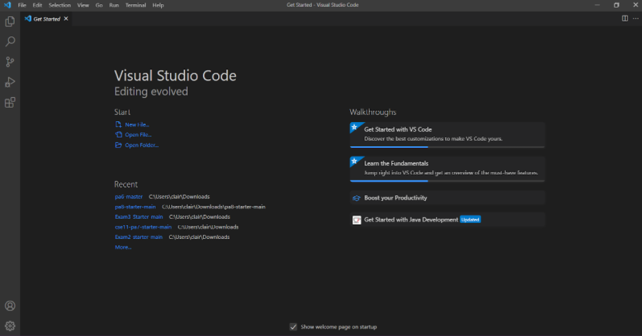
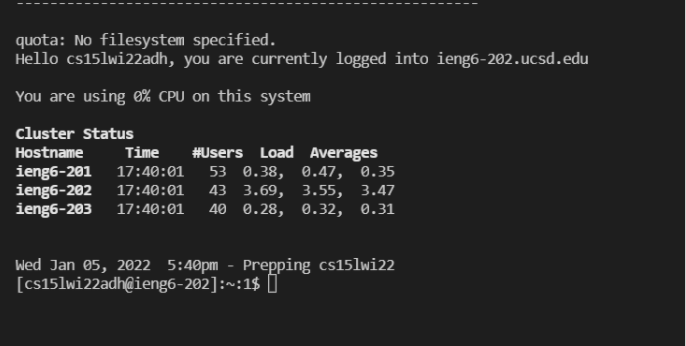
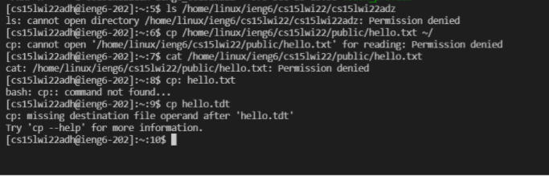
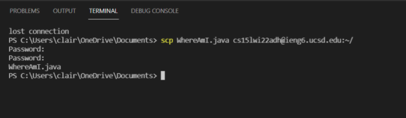
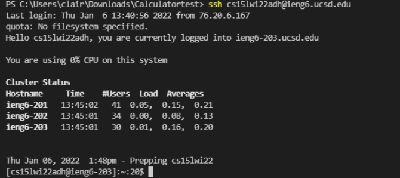
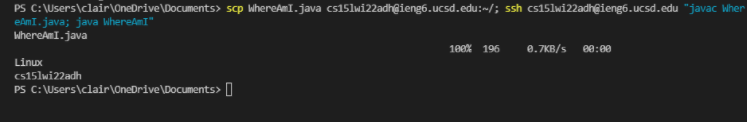

# Lab Report 1 - Week 2

## Installing VScode

* I had already installed VS Code last quarter for CSE11. I did so by going to **[this link](https://code.visualstudio.com/)** and clicking "download for Windows."

## Remotely Connecting

* In order to remotely connect, I had to first find my course specific account for CSE 15L by going to **[this website](https://sdacs.ucsd.edu/~icc/index.php)**. I then typed in the command “ssh (my account address)” and it prompted me to accept or decline and then enter my password. I accepted the message, and then entered the password for my school account.

## Trying Some Commands

* Once logged into the remote server, I tested out some commands. I tested the ls command, which tries to open the specified directory. I also tried `cp`, which tries to open a file for reading, and cat, which puts the specified file into the terminal. 

## Moving Files with scp

* Here, I tested the scp command on my local machine which copies a file into the remote server. Type `scp`, then the name of the file you are trying to move, and then the user address. It prompted me for my school account password and then once I typed the password in, the file was successfully copied over. 

## Setting an SSH Key

* On a Windows PC, in order to set an SSH key so you do not have to enter a password anymore, I had to first type `ssh-keygen -t ed25519` and when prompted for a password, I left it empty, which generated a public and private key. Next, I followed the steps **[here](https://docs.microsoft.com/en-us/windows-server/administration/openssh/openssh_keymanagement#user-key-generation)**. A summary of the steps I followed here are restarting VS code as administrator, and starting the ssh agent service and did `ssh-add (name of directory of the private key in my local files)` to add my private key into the service. After this, I used `scp` to copy the directory of the public key into the remote server. 

## Optimizing Remote Running

* Here is the fastest way I could copy a file onto the remote server and run it from there. After removing some lines of code from the WhereAmI.java file on my local computer, I first ran the scp command to copy the file to the remote server, and by adding a semicolon I could run the ssh command on the same line. By having `"javac WhereAmI.java; javaWhereAmI"` in double quotes,this both compiles and runs the file on the remote server and then logs out and returns to my local machine. 

