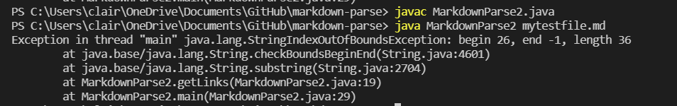

# Lab Report 2 - Week 4

## Code Change #1

* These are the initial changes we made to the code in MarkdownParse.java
* **[Link](https://github.com/declaire/markdown-parse/blob/main/mytestfile.md)** to a failure-inducing input that prompted me to make these changes

* Here is the symptom of the failure-inducing input.
* The symptom is that there is an out of bounds exception thrown in the output, and this is because in the failure-inducing input, there is a link without a close parenthesis at the end. This caused a bug when the program takes a substring from an open parenthesis to the close parenthesis. Because there is no close parenthesis, the index is -1, and the program cannot take a substring of a negative index, causing the exception to be throw.

## Code Change #2

* These are the changes we made to the code in MarkdownParse.java.
* **[Link](https://github.com/declaire/markdown-parse/blob/main/mytestfile3.md)** to a failure-inducing input that prompted me to make these changes

* Here is the symptom of the failure-inducing input.
* The symptom is that the image file is displayed in the output when we run the program even though we don't want it to be. This is because in the failure-inducing input, the image file uses a similar formatting to the link, which created a bug in which the program could not tell the difference between a link and an image.

## Code Change #3

* These are the changes we made to the code in MarkdownParse.java.
* **[Link](https://github.com/declaire/markdown-parse/blob/main/mytestfile2.md)** to a failure-inducing input that prompted me to make these changes

* Here is the symptom of the failure-inducing input.
* The symptom here is that the code shows certain image files in the output when we don't want it to. This is because in the failure inducing input, there were multiple image files on different lines, which triggered a bug in the program where the program would only account for the first image file. The bugged program would only search for the index of a specific character, which means it will always only account for the first image file and not the rest.