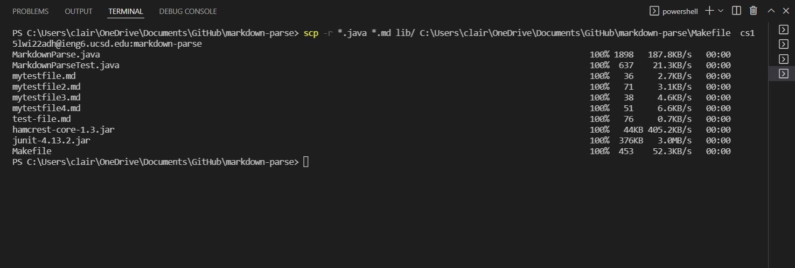

# Lab Report 3 - Week 6

## Copy whole directories with scp -r

* Copying my whole markdown-parse directory to your ieng6 account using the command `scp -r *.java *.md lib/ C:\Users\clair\OneDrive\Documents\GitHub\markdown-parse\Makefile  cs15lwi22adh@ieng6.ucsd.edu:markdown-parse`
* This command adds the whole directory and also the Makefile

* The command `ssh` allows me to log in to my ieng6 account
* The command `cd` allows me to change my directory to the markdown-parse directory

* Compiling and running the MarkdownParseTest file in the remote server

* Copying the whole directory and running the tests on one line using `ssh`, `scp`, `cd`, and `;`