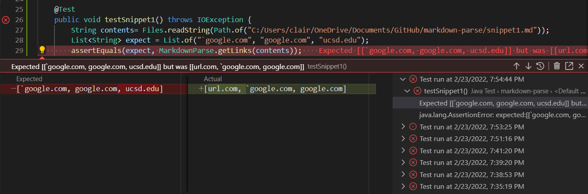
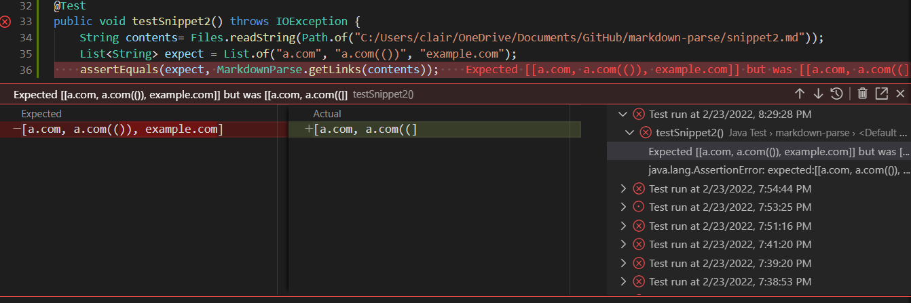
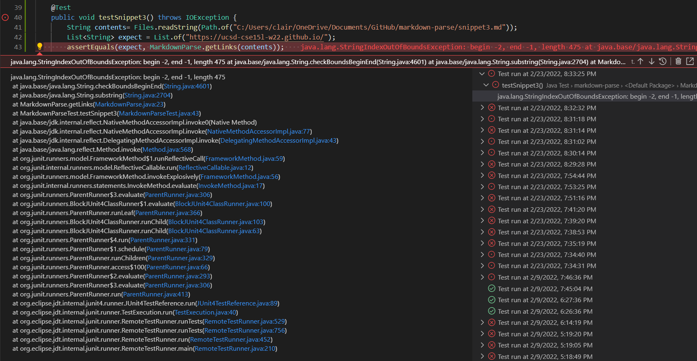

# Lab Report 4 - Week 8

## Links to Repositories:

[My Repository](https://github.com/ucsd-cse15l-w22/markdown-parse)

[Reviewed Repository](https://github.com/ajwboi/markdown-parse)

## My Implementation

### Snippet 1

* This picture shows the test I wrote in order to test snippet #1. This also shows the corresponding output to running the test, which was a failure.
* What this code SHOULD produce is [`google.com, google.com, ucsd.edu] according to [the CommonMark demo site](https://spec.commonmark.org/dingus/)

### Snippet 2

* This picture shows the test I wrote in order to test snippet #2. This also shows the corresponding output to running the test, which was a failure.
* What this code SHOULD produce is [a.com, a.com(()), example.com] according to [the CommonMark demo site](https://spec.commonmark.org/dingus/)

### Snippet 3

* This picture shows the test I wrote in order to test snippet #3. This also shows the corresponding output to running the test, which was a failure.
* What this code SHOULD produce is [https://ucsd-cse15l-w22.github.io/] according to [the CommonMark demo site](https://spec.commonmark.org/dingus/)

## Their Implementation

### Snippet 1

### Snippet 2

### Snippet 3

## My Answers to the Questions

### Snippet 1

* I believe there is a small code change that could help fix inline code with a backtick before the link, and that would be to make a simple check for whether there is a backtick at the index before the index of an open bracket, by adding an `if` statement after the variables in the while loop to check if the value of the value of the item at the index before the open bracket is a backtick. If it is a backtick, the program would not count that link as a real link, and skip to the next line by calling. 

### Snippet 2

