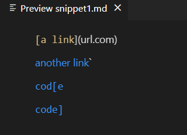
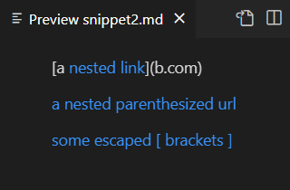
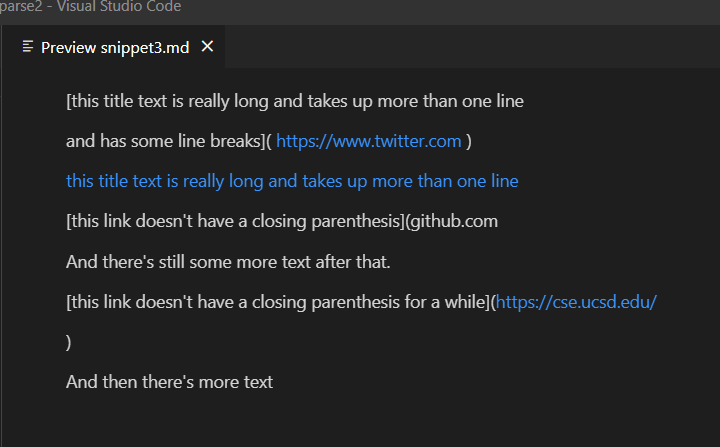
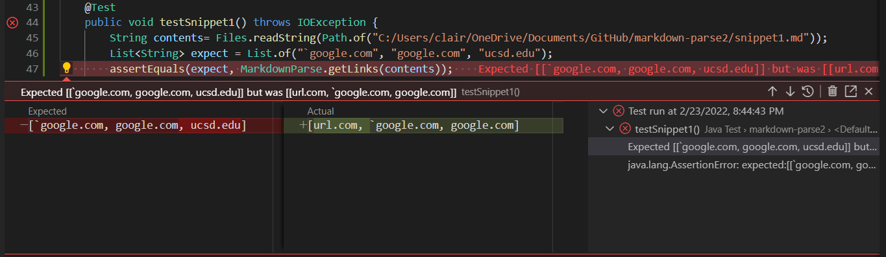
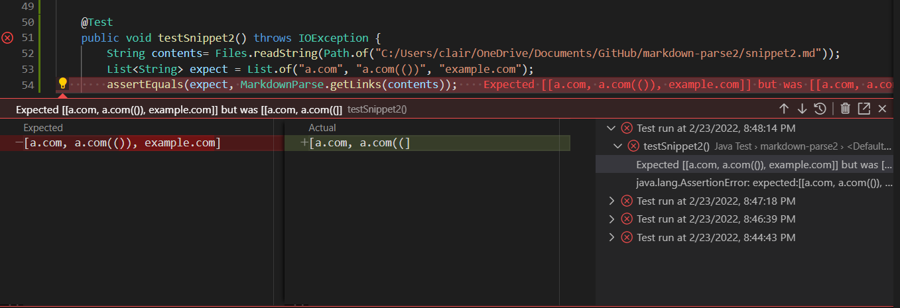
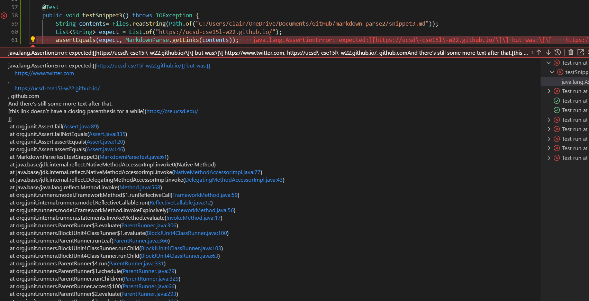

# Lab Report 4 - Week 8

## Links to Repositories:

[My Repository](https://github.com/ucsd-cse15l-w22/markdown-parse)

[Reviewed Repository](https://github.com/ajwboi/markdown-parse)

## My Implementation

### Snippet 1

* According to the VS code live preview, the valid links are [`google.com, google.com, ucsd.edu]

* This picture shows the test I wrote in order to test snippet #1. This also shows the corresponding output to running the test, which was a failure.

### Snippet 2

* According to the VS code live preview, the valid links are [a.com, a.com(()), example.com]

* This picture shows the test I wrote in order to test snippet #2. This also shows the corresponding output to running the test, which was a failure.

### Snippet 3

* According to the VS code live preview, the valid links are [https://ucsd-cse15l-w22.github.io/]

* This picture shows the test I wrote in order to test snippet #3. This also shows the corresponding output to running the test, which was a failure.

## Their Implementation

### Snippet 1

* According to the VS code live preview, the valid links are [`google.com, google.com, ucsd.edu]

* This picture shows the test I wrote in order to test their implementation for snippet #1. This also shows the corresponding output to running the test, which was a failure.

### Snippet 2

* According to the VS code live preview, the valid links are [a.com, a.com(()), example.com]

* This picture shows the test I wrote in order to test their implementation for snippet #2. This also shows the corresponding output to running the test, which was a failure.

### Snippet 3

* According to the VS code live preview, the valid links are [https://ucsd-cse15l-w22.github.io/]

* This picture shows the test I wrote in order to test their implementation for snippet #3. This also shows the corresponding output to running the test, which was a failure.

## My Answers to the Questions

### Snippet 1

* I believe there is a small code change that could help fix inline code with a backtick before the link, and that would be to make a simple check for whether there is a backtick at the index before the index of an open bracket, by adding an `if` statement after the variables in the `while` loop to check if the value of the value of the item at the index before the open bracket is a backtick. If it is a backtick, the program would not count that link as a real link, and skip to the next line. However, for other instances where the code has a backtick such as in the last line of snippet 1 where there is an extra closed bracket, it may take more than 10 lines to code, because you may need to add extra checks for if there are extra brackets which is more complicated to fix.

### Snippet 2
* I do not think there is a small code change that could handle snippet 2 and all related cases that nest parentheses, brackets, and escaped brackets, because you would probably need to add an extra counter and extra if statements checking how deeply nested a link or parenthesis/brackets are. I believe it would be too complicated to do in less than 10 lines, because you would also need to evaluate whether links are valid links are net depending on the way everything is nested, which would take extra lines. You would also need to change the way which the indices of the brackets and parenthesis are counted in order to account for the nesting, which would take more lines as well.

### Snippet 3
* I do not think there is a small code change that could handle snippet 3 and all related new line cases, because you would need to fix the index out of bounds error caused by the `else if` statement by changing the first `if` and `else if` statements in the `while` loop, which would likely take a couple lines. You would also need to implement a check to count for the index of a new line, and you would also need to add `if` statements to determine whether certain new lines are valid or not. For example, if there are more than one new lines between brackets or parentheses, the link would not be valid, and I believe in totality, fixing the index out of bounds error and adding the if statements would take more than 10 lines.

