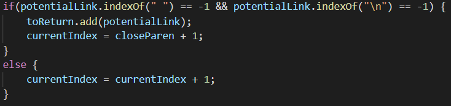

# Lab Report 5 - Week 10

## How I Found the Tests

* In order to find the tests with different results, I first used bash scripting. I copied the script and test files into our repository as shown above, and then ran the command `bash script.sh > file.txt` in both repositories. This command successfully saved the output of the bash script to a file in both repositories.

* Next, I used `diff` to compare the results of running the bash script in both repositories, which is how we found the differences between our test results.

## Test 1

* In line 270, our output is the bottom one `[/bar\* "ti\*tle"]` and Joe's output is the top one `[]`. 

* This corresponds with test 22.md, where the expected output is `[/bar\* "ti\*tle"]`. This means that our result is correct, and Joe's result is incorrect.

* The bug in Joe's code is caused by these lines. It searches for the index of a blank space, and if the index of a space is -1, meaning there is no blank space, then it will add the link to the output. This is a bug because if a valid link has a blank space in the middle of the link, then it will not be added to the output since the index is no longer -1. Because the input file has a blank space in the middle of the link, Joe's code does not add the link to the output, even though it is a valid link.

## Test 2

* In line 230, our output is the bottom one `[]` and Joe's output is the top one `[baz]`.

* This corresponds with test 201.md, where the expected output is `[]`. This means that our result is correct, and Joe's result is incorrect.

* The bug in Joe's code is caused by this line. It considers all text within the open and closing parenthesis as valid potential links, without considering that if there is text or spaces between the closed bracket and the open parenthesis, then it won't be a valid potential link. Because the input file has a space and the text `<bar>` between the parenthesis and the brackets, it is not actually a valid link since the close bracket and open parenthesis are not right next to eachother. However, Joe's code does not consider this.

